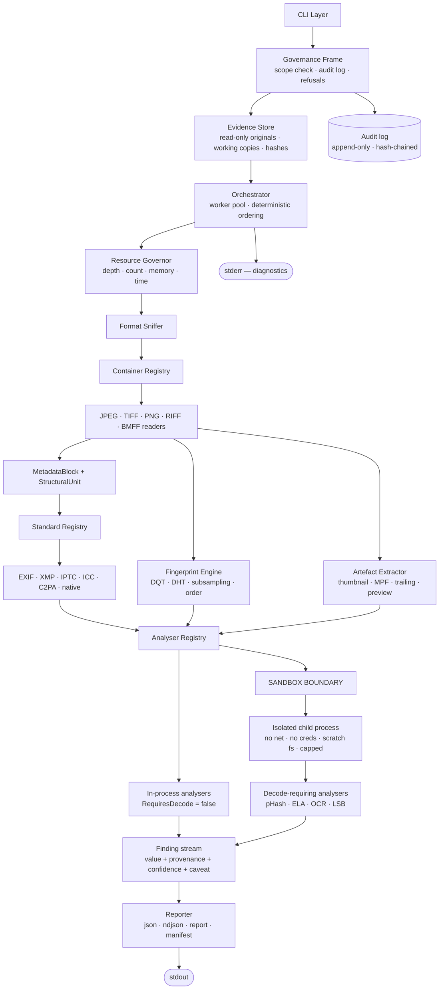

# Architecture — imgint

**Version:** 2.0 (draft)
**Status:** Proposed
**Date:** 2026-08-25
**Deciders:** Saranya
**Traces to:** `SRD.md` requirement IDs

---

## 1. Requirements summary

### Functional drivers
- Seven extraction tiers across all Tier-1 image formats (FR-1.x – FR-8.x)
- Attribution from encoder fingerprints when metadata is absent (FR-3.x)
- Every derived finding carries confidence and caveat (FR-9.2, NFR-2.2)
- Authorization enforced, custody maintained, refusals in code (GR-1.x – GR-3.x)

### Non-functional drivers

| Driver | Target | Architectural consequence |
|---|---|---|
| Untrusted input must be decoded | NFR-1.1 | Process isolation becomes mandatory → ADR-004 |
| No investigation may leak | GR-4.1–4.5 | Offline-first with bundled datasets → ADR-005 |
| No verdicts, ever | NFR-2.1 | Confidence is a type-level requirement → ADR-008 |
| Custody must survive challenge | GR-2.x | Immutable store + hash chain as a base layer → ADR-002 |
| Refusals must be structural | GR-3.7 | No capability may exist to be enabled → ADR-003 |
| Startup <50ms, single binary | NFR-3.1, NFR-5.2 | Constrains language → ADR-009 |
| New format or analyser = one file | NFR-5.3, NFR-5.4 | Two-layer registry + analyser registry → ADR-006 |

---

## 2. Architectural thesis

The v1 architecture rested on *"we never decode pixels"* — which eliminated an entire CVE class for free.

**OSINT scope destroys that property.** Perceptual hashing, ELA, OCR, and steganography screening all need real pixels, and decoding attacker-controlled images is precisely how libwebp CVE-2023-4863 and a long line of predecessors were exploited.

So the safety property has to be rebuilt rather than inherited, and it is rebuilt structurally:

> **Governance wraps everything. Decoding is exiled to a sandbox. Findings cannot exist without uncertainty attached.**

Three invariants, each enforced by structure rather than discipline:

1. **No extraction runs outside a governance frame.** The scope check and audit log are not called by the pipeline — they *contain* it.
2. **No decoder runs in the parent process.** An analyser declaring `RequiresDecode()` is dispatched to an isolated child that holds nothing worth stealing.
3. **No finding can be constructed without confidence and caveat.** These are required fields on the type, validated in CI, so overclaim is a compile-and-test failure rather than a judgement call.

---

## 3. System design

### 3.1 Layered view



### 3.2 Analysis of one file

```mermaid
sequenceDiagram
    participant G as Governance
    participant S as Evidence Store
    participant O as Orchestrator
    participant C as Container Layer
    participant A as Analyser Registry
    participant X as Sandbox Child
    participant L as Audit Log

    G->>G: load scope, verify signature and expiry
    G->>L: append(scope_loaded)
    G->>S: ingest(file)
    S->>S: SHA-256 of original
    S->>L: append(ingest, hash)
    S->>O: working copy handle
    O->>C: walk container
    C-->>O: StructuralUnits + MetadataBlocks
    O->>A: dispatch analysers permitted by scope
    A->>A: in-process (no decode)
    A->>X: spawn sandboxed child (decode required)
    X->>X: decode under memory / CPU / wall caps
    alt child fails or exceeds cap
        X--xO: terminated
        O->>L: append(analyzer_failed)
        Note over O: batch continues; file marked partial
    else success
        X-->>O: Findings
    end
    O->>O: attach confidence + caveat (required fields)
    O->>S: verify original hash unchanged
    S-->>G: match / MISMATCH → exit 7
    O->>L: append(analysis_complete)
    O-->>G: Analysis record
```

### 3.3 Module layout

```
imgint/
├── cmd/imgint/           CLI — the only place aware of flags and exit codes
├── internal/sandbox/     child entry point; nothing else may import this
├── pkg/
│   ├── governance/       scope, refusals, audit chain
│   ├── evidence/         store, hashing, working copies, manifest
│   ├── source/           bounded windowed reader
│   ├── sniff/            magic-byte detection
│   ├── container/        registry + jpeg tiff png riff bmff
│   ├── standard/         registry + exif xmp iptc icc c2pa native
│   ├── fingerprint/      DQT/DHT extraction, corpus matching
│   ├── artefact/         thumbnail, MPF, trailing, RAW preview
│   ├── analyzer/         registry + tier 5-7 analysers
│   ├── model/            Finding, Confidence, Diagnostic, Record
│   ├── report/           renderers + hash manifest
│   └── governor/         resource budgets
├── corpus/               versioned fingerprint reference DB
├── testdata/labeled/     150+ images with ground truth — the actual science
└── docs/                 PRD SRD SRS PLAN ARCHITECTURE SECURITY ETHICS
```

Dependencies point strictly inward. Nothing in `pkg/` writes to standard streams, calls `os.Exit`, or opens a socket.

---

## 4. Architecture Decision Records

---

### ADR-001: Governance as an enclosing frame, not a called service

**Status:** Accepted · **Date:** 2026-08-25

#### Context
GR-1.1 requires that no extraction occur without a valid authorization scope. GR-2.5 requires every action to be audited. A control that the pipeline *calls* is a control the pipeline can forget to call — and the failure is silent.

#### Decision
Governance is the outermost layer. The orchestrator is constructed by the governance frame and receives an already-validated scope handle. There is no code path from CLI to extraction that does not pass through scope validation, and audit entries are emitted by the frame rather than by individual analysers.

#### Options considered

**Option A — Governance as a called service**

| Dimension | Assessment |
|---|---|
| Complexity | Low |
| Enforcement strength | Weak — depends on every call site |
| Auditability | Poor — checks scattered |

**Pros:** minimal restructuring; familiar.
**Cons:** one missing call is a silent bypass; impossible to prove exhaustiveness in review.

**Option B — Enclosing frame**

| Dimension | Assessment |
|---|---|
| Complexity | Medium |
| Enforcement strength | Strong — structurally unavoidable |
| Auditability | Excellent — one place to review |

**Pros:** bypass requires deliberate restructuring, not an oversight; the security property is provable by reading one file.
**Cons:** every entry point must be routed through it; `--self-audit` needs an explicit, narrow carve-out.

**Option C — External wrapper script**

| Dimension | Assessment |
|---|---|
| Complexity | Very low |
| Enforcement strength | None — trivially bypassed |

**Pros:** zero code change.
**Cons:** the binary remains fully capable without it, which means the control does not exist.

#### Trade-off analysis
The distinguishing question for any control is "what happens when someone forgets?" Under Option A, nothing happens and no one notices. Under Option B, the code does not compile or the run does not start. That difference is the entire value of the control, and it costs roughly one day of restructuring.

#### Consequences
- **Easier:** proving the security property; onboarding reviewers; writing `ETHICS.md` truthfully
- **Harder:** testing extraction in isolation requires a test scope fixture; `--self-audit` needs careful narrow scoping
- **Revisit if:** a legitimate use case genuinely cannot obtain a scope — then design a narrower carve-out, never a general bypass

#### Action items
1. [ ] Implement the governance frame in Phase 0, before any extraction code exists
2. [ ] Add a test asserting that every CLI command path fails without a scope
3. [ ] Give `--self-audit` its own restricted code path with file-ownership verification

---

### ADR-002: Immutable evidence store with a hash-chained audit log

**Status:** Accepted · **Date:** 2026-08-25

#### Context
GR-2.1–2.8 require originals to survive untouched, hashes to be recorded before processing, and the action record to be tamper-evident. Output may be challenged in a legal setting years later.

#### Decision
Originals are stored read-only and hashed on ingest, before any other operation. All work occurs on separate copies. The audit log is append-only JSONL where each entry embeds the previous entry's hash, making any deletion or alteration detectable at a specific index.

#### Options considered
- **Work directly on originals** — simplest, and disqualifying. A single write bug destroys evidence irrecoverably.
- **Copy-on-write with a flat log** — protects originals but the log itself is silently editable, which is exactly what a challenge will target.
- **Copy-on-write with a hash-chained log** — protects originals and makes log tampering detectable and locatable.
- **External WORM storage or a blockchain anchor** — strongest guarantee, but adds infrastructure and breaks the air-gapped requirement (ADR-005).

#### Trade-off analysis
Hash chaining costs one hash per entry and a few lines of code. It does not prevent an attacker with full disk access from rewriting the whole chain — nothing local can — but it makes *partial* tampering, which is the realistic threat, immediately visible. Optional external anchoring can be layered on later without changing the format.

#### Consequences
- **Easier:** defending the process; reproducing an analysis; detecting accidental corruption
- **Harder:** disk usage roughly doubles; retention policy becomes mandatory; the log format is now effectively frozen
- **Revisit if:** multi-analyst custody is needed — that requires signed entries per operator, a distinct problem

#### Action items
1. [ ] Implement `audit verify` alongside the writer, in the same commit
2. [ ] Test chain integrity after SIGINT and after `kill -9`
3. [ ] Define the retention and purge path before v1

---

### ADR-003: Refused capabilities are absent, not disabled

**Status:** Accepted · **Date:** 2026-08-25

#### Context
GR-3.1–3.8 refuse face recognition, platform scraping, identity correlation, person tracking, external hash-DB lookup, and authenticity verdicts. GR-3.7 requires these to be unreachable through any configuration.

#### Decision
The capabilities are not implemented at all. No flag, config key, or environment variable exists that would enable them. `ETHICS.md` documents each refusal and its rationale.

#### Options considered

**Option A — Implemented but disabled by default**

| Dimension | Assessment |
|---|---|
| Enforcement | Weak — one flag away |
| Honesty | Poor — "we support this but ask you not to" |

**Pros:** flexible for a claimed future legitimate use.
**Cons:** the capability exists, so the tool *is* a surveillance tool with a polite default.

**Option B — Not implemented**

| Dimension | Assessment |
|---|---|
| Enforcement | Strong for casual misuse |
| Honesty | High — the claim matches the binary |

**Pros:** the refusal is truthful; a fork that adds it must do so deliberately and visibly; scope stays focused.
**Cons:** does not stop a determined forker; a legitimate edge case cannot be served.

**Option C — Implemented with authorization gating**

| Dimension | Assessment |
|---|---|
| Enforcement | Moderate |
| Complexity | High |

**Pros:** serves authorised users under audit.
**Cons:** who authorises? Biometric processing needs a legal basis this project cannot verify. Complexity without a credible verifier.

#### Trade-off analysis
The honest objection to Option B is that it does not stop anyone determined — the source is open. That is true and not the point. The purposes served are: the shipped binary cannot be misused casually or accidentally; the project's stated ethics match its actual capabilities; and adding the capability becomes a deliberate, attributable act by whoever does it rather than a flag flip. Those are worth having even though they are not enforcement in the cryptographic sense.

Option C fails on a concrete question: biometric processing under GDPR Art. 9 requires a lawful basis that a CLI tool has no means of verifying. Building a gate you cannot validate is theatre.

#### Consequences
- **Easier:** ethical position is defensible and true; scope stays tight; review is straightforward
- **Harder:** genuinely authorised biometric work must use a different tool — which is the correct outcome
- **Revisit if:** a specific, legally-grounded use case emerges with a verifiable authorisation mechanism

#### Action items
1. [ ] Write `ETHICS.md` before writing extraction code, so it constrains rather than describes
2. [ ] Add a test asserting no config path reaches a refused capability
3. [ ] State the refusals in `--help` output, not only in documentation

---

### ADR-004: Pixel decoding exiled to a sandboxed subprocess

**Status:** Accepted · **Date:** 2026-08-25

#### Context
v1's strongest safety property was never decoding pixels. OSINT scope requires perceptual hashing, ELA, OCR, and LSB analysis — all of which need decoded pixels. Image decoders have a long exploitation history (libwebp CVE-2023-4863, repeated libjpeg-turbo and libheif issues, the ImageMagick delegate surface), and this tool exists specifically to process files that may be hostile.

#### Decision
Analysers declare `RequiresDecode()`. Any that returns true executes only inside an isolated child process with no network access, no credentials, no environment inheritance, a scratch-only filesystem view, and hard memory, CPU-time, and wall-clock caps. The parent never links a decoder.

#### Options considered

**Option A — Decode in-process with careful coding**

| Dimension | Assessment |
|---|---|
| Complexity | Low |
| Blast radius | Full process — credentials, evidence store, audit log |
| Track record | Poor — this is precisely how these CVEs are exploited |

**Pros:** simple; fast; no IPC.
**Cons:** a decoder RCE gets everything, including the evidence store the tool exists to protect.

**Option B — Sandboxed subprocess**

| Dimension | Assessment |
|---|---|
| Complexity | Medium-high — three platform implementations |
| Blast radius | Scratch directory containing one already-untrusted file |
| Portability | Requires seccomp / sandbox_init / Job Objects abstraction |

**Pros:** contains the realistic worst case; caps hangs and memory bombs for free; a clean fuzzing boundary.
**Cons:** IPC overhead per file; platform-specific code; a fallback policy needed where sandboxing is unavailable.

**Option C — Container or VM isolation**

| Dimension | Assessment |
|---|---|
| Complexity | High — runtime dependency |
| Blast radius | Smallest |
| Usability | Poor — breaks single-binary distribution |

**Pros:** strongest isolation.
**Cons:** violates NFR-5.2; unusable air-gapped without preloaded images; heavy per-file cost.

**Option D — Reimplement decoders in a memory-safe language**

| Dimension | Assessment |
|---|---|
| Complexity | Very high |
| Correctness risk | High — decoders are subtle |

**Pros:** no native dependency.
**Cons:** months of work; memory safety does not prevent logic bugs; still worth sandboxing afterwards.

#### Trade-off analysis
Option A is disqualified by the threat model: the parent holds the evidence store and the audit log — the two things whose integrity the entire product depends on — so an in-process decoder RCE compromises exactly what the tool was built to protect. Option C's isolation is better but costs the single-binary property that makes air-gapped operation practical, and air-gapped operation is a stated requirement (GR-4.5).

Option B's real cost is three platform implementations behind one interface, roughly a week. In exchange, resource caps and hang protection come for free, and the process boundary becomes an excellent fuzzing target.

Where sandboxing is unavailable, decode-requiring analysers **refuse to run** and say so. They do not silently fall back to in-process decoding — a safety control with a silent fallback is not a control.

#### Consequences
- **Easier:** containing decoder vulnerabilities; enforcing per-file resource caps; fuzzing across a clean boundary
- **Harder:** three sandbox implementations; IPC overhead; degraded functionality on unsupported platforms
- **Revisit if:** a platform's sandboxing proves unworkable — then disable decode analysers there, never weaken the boundary

#### Action items
1. [ ] Build the sandbox in Phase 4, before any decode-requiring analyser is written
2. [ ] Fault-injection suite: child crash, hang, OOM, attempted network call, attempted escape
3. [ ] Fuzz across the IPC boundary continuously in CI
4. [ ] Document the platform fallback policy in `SECURITY.md`

---

### ADR-005: Offline-first as a security control

**Status:** Accepted · **Date:** 2026-08-25

#### Context
Reverse geocoding a target's coordinates through a commercial API discloses to that provider what is being investigated, when, and from where. Those logs are retained, subpoenable, and occasionally breached. For journalism this can endanger a source; for law enforcement it can compromise an operation.

#### Decision
The tool makes no network connection by default. Reverse geocoding uses a bundled offline dataset. `--allow-network` enables a fixed list of lookups, each individually logged and surfaced in the report as a disclosure event. No telemetry, update check, or crash reporting exists under any configuration.

#### Options considered
- **Online APIs with an offline flag** — better data quality and a smaller binary, but the default leaks, and defaults are what almost everyone uses.
- **Offline-only** — no leak possible, but blocks genuinely useful lookups and forces a large bundled dataset.
- **Offline default, network opt-in and disclosed** — leak-free by default, escape hatch available, and the disclosure record means the operator can always answer "what did this tool tell anyone?"

#### Trade-off analysis
The cost is binary size: a usable offline geocoding index runs to hundreds of megabytes at full resolution, though a coarser admin-level index is far smaller and sufficient for most forensic purposes. That is an acceptable price for a property that cannot be achieved any other way.

The disclosure-event requirement matters as much as the default: an analyst producing a report must be able to state exactly what was transmitted and to whom. Without that record, "we worked offline" is an unverifiable claim.

#### Consequences
- **Easier:** air-gapped operation; source protection; honest disclosure in reports
- **Harder:** larger distribution; bundled data goes stale and needs a versioned update path
- **Revisit if:** dataset size becomes prohibitive — ship tiered resolution, never an online default

#### Action items
1. [ ] Select and version the offline geocoding dataset; record its version in reports
2. [ ] Add a CI network monitor asserting zero egress in default runs
3. [ ] Implement the disclosure-event record before implementing any lookup

---

### ADR-006: Two-layer registry, extended with an analyser layer

**Status:** Accepted · **Date:** 2026-08-25 · **Supersedes:** v1 ADR-001

#### Context
v1 established that container readers locate opaque byte blocks and standard parsers interpret them, giving N+M rather than N×M implementations. OSINT scope adds a third concern — analysers that consume parsed output plus, sometimes, decoded pixels.

#### Decision
Three registries. Containers emit `MetadataBlock` and `StructuralUnit`. Standard parsers emit `Field`. Analysers consume fields, artefacts, and optionally pixels, emitting `Finding`. Each layer knows only the layer directly below.

#### Options considered
- **Fold analysers into parsers** — fewer moving parts, but couples interpretation to extraction, and analysers that span standards (e.g. cross-checking GPS timestamp against EXIF timestamp) have nowhere to live.
- **Three-layer registry** — one more interface, clean separation, analysers become independently testable and independently gateable by scope.
- **Pipeline of generic transforms** — maximally flexible, but loses the type distinctions that make the sandbox dispatch and the scope gating possible.

#### Trade-off analysis
The analyser layer earns its place through the `RequiresDecode()` flag alone: that single method is what lets the orchestrator route work across the sandbox boundary without any analyser knowing the boundary exists. It also gives scope gating (GR-1.5) a natural unit — a scope disables analysers by ID, which is meaningful to a non-programmer writing the scope file.

#### Consequences
- **Easier:** new analysers are one file; sandbox routing is automatic; scope gating is per-analyser
- **Harder:** three interfaces to keep coherent; cross-cutting analysers need a well-designed context object
- **Revisit if:** analysers begin needing container-level detail — extend `AnalysisContext` with explicit named data rather than leaking the container type

#### Action items
1. [ ] Define `Finding`, `AnalysisContext`, and `Analyzer` before Phase 2
2. [ ] Add an import lint preventing `analyzer/` from importing `container/`
3. [ ] Make analyser IDs stable and public — scope files reference them

---

### ADR-007: Fingerprint corpus is versioned data, not code

**Status:** Accepted · **Date:** 2026-08-25

#### Context
Attribution from encoder fingerprints is the project's differentiator, and its accuracy depends entirely on reference data that goes stale as new devices and app versions ship. FR-3.9 requires reports to record which corpus version produced a result.

#### Decision
The reference corpus is a versioned SQLite artefact shipped alongside the binary, updatable independently. Every attribution finding records the corpus version. Below the match threshold, the tool reports `insufficient reference data` rather than a low-confidence guess.

#### Options considered
- **Compile the corpus into the binary** — one artefact, but every corpus update needs a release, and results become untraceable to a data version.
- **Versioned data file** — updatable independently, traceable, and analysts can pin a version for reproducibility.
- **Online lookup service** — always current and centrally improvable, but violates ADR-005 outright and discloses fingerprints of files under investigation.

#### Trade-off analysis
The online option is superficially attractive — attribution genuinely improves with pooled data — and is disqualified by exactly the reasoning in ADR-005: sending a fingerprint of an evidence file to a server discloses the investigation.

The reproducibility argument settles the rest. An analysis performed today must be reproducible in two years. That is impossible unless the reference data is versioned, pinnable, and recorded in the report.

#### Consequences
- **Easier:** corpus improves without a code release; results are reproducible and citable; accuracy claims are scoped to a version
- **Harder:** corpus provenance and licensing must be tracked; two artefacts to distribute; accuracy must be republished per version
- **Revisit if:** a community contribution model is wanted — that needs a submission provenance scheme of its own

#### Action items
1. [ ] Define corpus schema and versioning before Phase 2
2. [ ] Publish measured accuracy per corpus version
3. [ ] Record corpus version in every report carrying an attribution
4. [ ] Document how corpus entries were captured and licensed

---

### ADR-008: Confidence and caveat as required fields

**Status:** Accepted · **Date:** 2026-08-25

#### Context
The dominant harm from tools in this category is not failure — it is overclaim. ELA heat maps read as proof of manipulation, absent metadata read as evidence of tampering, and camera timestamps read as ground truth have all contributed to real misidentifications. NFR-2.1 and NFR-2.2 forbid verdicts and require uncertainty on every derived finding.

#### Decision
`Finding` cannot be constructed without `confidence` and, for anything above `observed`, `caveat`. Schema validation in CI fails on any violation. Confidence values are `observed`, `derived`, `indicative`, `inconclusive` — with no `confirmed`. Indicators are never aggregated into a score. Reports lead with `not_established`.

#### Options considered
- **Documentation-only guidance** — zero code cost, and the caveats live where nobody reads them. Reports get quoted without their context.
- **Required type fields with CI validation** — overclaim becomes a build failure; caveats travel with the data into every downstream consumer.
- **Post-hoc review before publication** — human judgement is better than any rule, and does not scale to batch output.

#### Trade-off analysis
The decisive consideration is that findings get extracted from their context. Someone pastes a JSON field into a chat, a story, or a court filing. If the caveat is a field on the finding, it travels; if it is a paragraph in the docs, it does not.

Omitting `confirmed` from the confidence scale is deliberate and slightly uncomfortable. Some findings really are certain — a byte is present or it is not. Those are `observed`, which is honest: the observation is certain, its *meaning* is not. Providing no vocabulary for "confirmed" removes the temptation to reach for it.

Refusing to aggregate indicators (FR-7.8) will be the most-requested missing feature. Aggregation is exactly where overclaim happens: three weak indicators summed into "78% likely manipulated" is a number with no defensible construction that will nonetheless be quoted as fact.

#### Consequences
- **Easier:** defending the tool's output; explaining findings to non-experts; resisting misuse
- **Harder:** output is more verbose; users will ask for a single score and be refused
- **Revisit:** never for the verdict prohibition. The caveat vocabulary may be refined

#### Action items
1. [ ] Make `confidence` and `caveat` non-optional on the `Finding` type
2. [ ] Add CI schema validation rejecting any finding lacking them
3. [ ] Write caveat text for every indicator alongside the indicator, in the same commit
4. [ ] Make `not_established` a required field and render it first in reports

---

### ADR-009: Implementation language

**Status:** Proposed — decide before Phase 1 · **Date:** 2026-08-25

#### Context
NFR-3.1 caps startup at 50ms. NFR-5.2 requires a self-contained binary. ADR-004 requires platform sandboxing. NFR-1.9 requires continuous fuzzing. Against this: a single developer with a deadline.

#### Options considered

**Option A — Go**

| Dimension | Assessment |
|---|---|
| Startup | ~5ms ✅ |
| Distribution | Single static binary ✅ |
| Sandboxing | seccomp via libseccomp or raw syscalls; workable, not idiomatic |
| Fuzzing | Built into the toolchain ✅ |
| Concurrency | Excellent — suits the worker pool ✅ |
| Dev speed | Good ✅ |

**Option B — Rust**

| Dimension | Assessment |
|---|---|
| Startup | ~2ms ✅ |
| Distribution | Single static binary ✅ |
| Sandboxing | Best ecosystem support ✅ |
| Fuzzing | Best-in-class ✅ |
| Hostile-input safety | Strongest guarantees ✅ |
| Dev speed | Poor without prior experience ❌ |

**Option C — Python**

| Dimension | Assessment |
|---|---|
| Startup | 150–400ms ❌ fails NFR-3.1 |
| Distribution | ❌ fails NFR-5.2 |
| Sandboxing | Weak |
| Dev speed | Excellent ✅ |

#### Trade-off analysis
Python fails two hard NFRs. If chosen for schedule reasons, amend NFR-3.1 and NFR-5.2 explicitly in the SRD — writing "startup time was traded for development speed" in the report is respectable; silently missing a stated requirement is not.

The OSINT scope shifts the balance toward Rust relative to v1. The threat model now centres on parsing and decoding hostile input, sandboxing is a first-class requirement, and Rust is materially better at both. Against that, its learning curve is the dominant schedule risk for a single developer.

**Recommendation: Go**, unless you already have Rust experience — in which case Rust is the better fit for this specific threat model. Whichever is chosen, the sandbox child may be written in a different language from the parent; the IPC boundary makes that a clean option worth remembering.

#### Consequences
- **Easier (Go):** concurrency, distribution, CI matrix, built-in fuzzing
- **Harder (Go):** sandbox syscall work is less idiomatic; no compile-time guarantees on parser memory safety
- **Revisit:** before Phase 1. After that it is expensive

#### Action items
1. [ ] Two-day spike: JPEG `DQT` extraction plus a minimal seccomp sandbox
2. [ ] If Python is chosen, formally amend NFR-3.1 and NFR-5.2 in the SRD
3. [ ] Lock the decision before the container interface is written

---

### ADR-010: Library-first, CLI as reference client

**Status:** Accepted · **Date:** 2026-08-25 · **Carried forward from v1 ADR-010**

#### Context
NFR-5.5 requires library usability without the CLI. The `0x0A` angle wants WASM for a browser tool that uploads nothing — which for a privacy tool is not a nice-to-have but the most persuasive possible demo.

#### Decision
All logic lives in `pkg/`. `cmd/imgint` handles only flags, output selection, and exit-code mapping. `internal/sandbox` is the child entry point and is importable by nothing else. No `pkg/` code touches standard streams, calls `os.Exit`, or opens a socket.

#### Options considered
- **CLI-first, extract later** — extraction becomes a rewrite in practice, because print statements and early exits diffuse through the analysis code.
- **Library-first from commit one** — small ongoing discipline cost; CLI, WASM demo, and any future server all become clients of one tested core.

#### Trade-off analysis
The discipline cost is returning errors and diagnostics rather than printing them — which is required anyway, since `--json` diagnostics cannot exist if analysers print to stderr directly. The constraint that looks like overhead is in fact the design that makes the required output format possible.

WASM has a wrinkle worth planning for: the browser has no subprocess model, so decode-requiring analysers cannot be sandboxed the same way. In WASM builds they are simply absent — which is acceptable, because the browser tool's job is Tier 1–3 privacy inspection, not full forensics.

#### Consequences
- **Easier:** WASM demo; testability; the core is importable by other projects
- **Harder:** no printing from inside an analyser; WASM builds ship a reduced analyser set
- **Revisit:** never. Structural

#### Action items
1. [ ] Import lint: `pkg/` may not import `cmd/` or `internal/sandbox`, nor write to standard streams
2. [ ] Build WASM in CI from Phase 2 so coupling is caught the day it appears
3. [ ] Document which analysers are unavailable in WASM builds

---

## 5. Technology recommendations

| Concern | Recommendation | Rationale |
|---|---|---|
| Language | **Go** (Rust if experienced) | ADR-009 |
| CLI framework | cobra + viper | Subcommands, completions, config precedence |
| Sandboxing | seccomp-bpf / `sandbox_init` / Job Objects behind one interface | ADR-004 |
| Corpus store | SQLite, versioned artefact | ADR-007 |
| Geocoding | GeoNames-derived offline index, tiered resolution | ADR-005 |
| XML | Stdlib with entities disabled | NFR-1.7; avoid third-party XML libraries |
| Hashing | Stdlib SHA-256; pHash implemented in-tree | Avoids a native dependency in the sandbox |
| Report | Markdown → PDF via a pure-language renderer | Keeps the single-binary property |
| CI | GitHub Actions, 3 OS × 2 arch, fuzz job, network monitor, schema validation | NFR-5.1, NFR-1.9, NFR-2.2 |

---

## 6. Risks and mitigations

| # | Risk | Impact | Likelihood | Mitigation | Owner |
|---|---|---|---|---|---|
| R-1 | Overclaimed finding contributes to a wrong accusation | Critical | Medium | ADR-008: no verdicts, required caveats, published FP rates, `not_established` first in reports | ADR-008 |
| R-2 | Tool repurposed for surveillance | Critical | Medium | ADR-001 governance frame, ADR-003 refusals absent from the binary, audit log, ETHICS.md | ADR-001/003 |
| R-3 | Sandbox escape via decoder RCE | Critical | Low | ADR-004: isolation by default, no credentials in child, resource caps, boundary fuzzing | ADR-004 |
| R-4 | Investigation disclosed via a lookup | High | Medium | ADR-005: offline default, per-call disclosure events, no telemetry | ADR-005 |
| R-5 | Fingerprint corpus too thin to support accuracy claims | High | High | ADR-007: report `insufficient reference data`; publish accuracy per corpus version | ADR-007 |
| R-6 | Evidence inadmissible on procedural grounds | High | Medium | ADR-002: hash on ingest, read-only originals, hash chain; legal review before v1 | ADR-002 |
| R-7 | Sandbox unimplementable on a target platform | Medium | Medium | Decode analysers refuse rather than falling back; documented in SECURITY.md | ADR-004 |
| R-8 | Governance frame slows development enough to be bypassed "temporarily" | Medium | High | Build it in Phase 0 so it is never the thing standing between you and progress | ADR-001 |
| R-9 | Scope creep into an ExifTool clone or a general OSINT suite | High | Medium | PRD non-goals binding; every feature reviewed against them | Ongoing |

---

## 7. Open architecture questions

1. **`--self-audit` carve-out.** File ownership is a weak proxy for "your own photo". Is there a better check that doesn't require an account?
2. **Sandbox IPC.** Shared memory is faster; pipes are simpler and safer to fuzz. Leaning pipes for v1 — measure before optimising.
3. **Corpus contribution model.** Community submissions would materially improve attribution, but require a provenance scheme so contributed fingerprints can be trusted and attributed.
4. **Report signing.** Detached signature is simple; embedded requires a defined canonical form. Which do real workflows actually accept?
5. **Retention enforcement.** Should scope expiry trigger automatic purge of working copies, or only refuse further analysis? Automatic deletion has its own evidentiary risks.
6. **WASM analyser set.** Which Tier 5–6 analysers are safe without a subprocess model, and how is their absence communicated in the browser UI?
